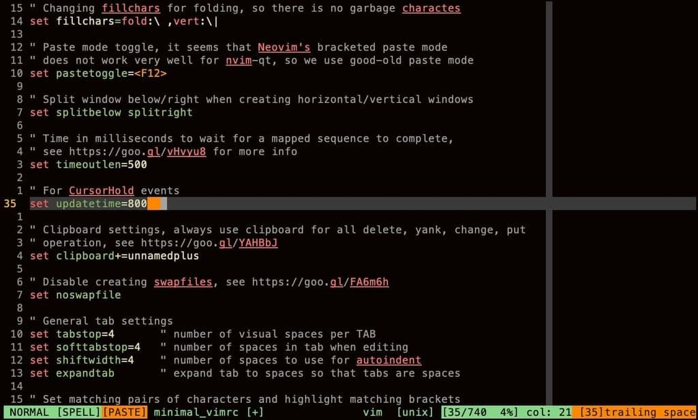

# Introduction

This is a minimal Vim/[Neovim](https://github.com/neovim/neovim) configuration
in just one file without external dependencies. The purpose is to provide a
light-weight and ready-to-use Vim config for quick editing.

The config is tested in Vim 9 and Nvim 0.8.0.

<p align="center">

</p>

# Feature

It's just blazingly fast(80ms startup time) with all the sane starter configs.

- A Timelss Theme: Gruvbox
- As builtin status line
- Some reasonable autocommands
- No extra dependencies
- Cross-platform compatible(vim/neovim, mac/linux/windows)
- (no autocomplete or autoformat or lsp, for obvious reasons)

# How to use

## 🐧 On Unix(mac or linux) systems

### For Neovim/Vim

```bash
mkdir -p ~/.config/nvim && cd ~/.config/nvim
git clone https://github.com/mino29/minimal_vim.git .
cp .vimrc $home/.vimrc
```

## ⏹ On Windows

### For Neovim/Vim

**One line Install**
``` powershell
Invoke-WebRequest https://raw.githubusercontent.com/mino29/minimal_vim/master/utils/install.ps1 -UseBasicParsing | Invoke-Expression
```
