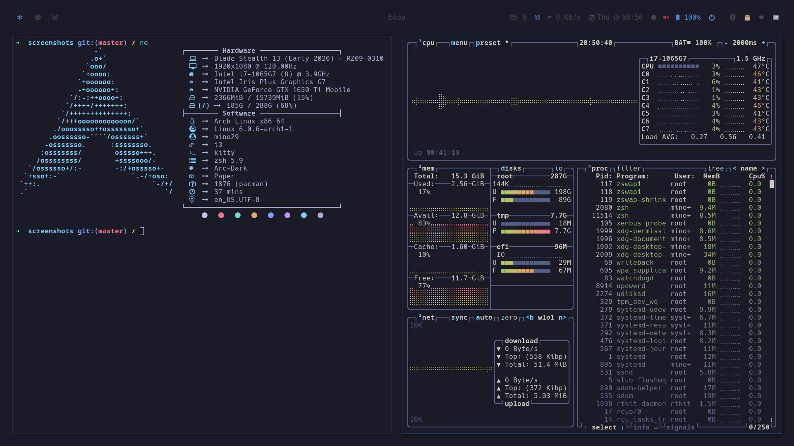
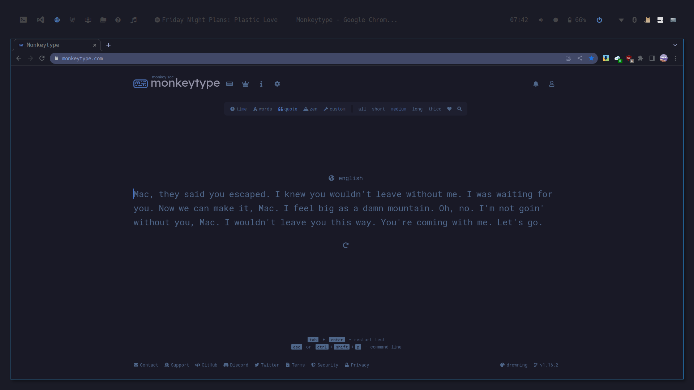
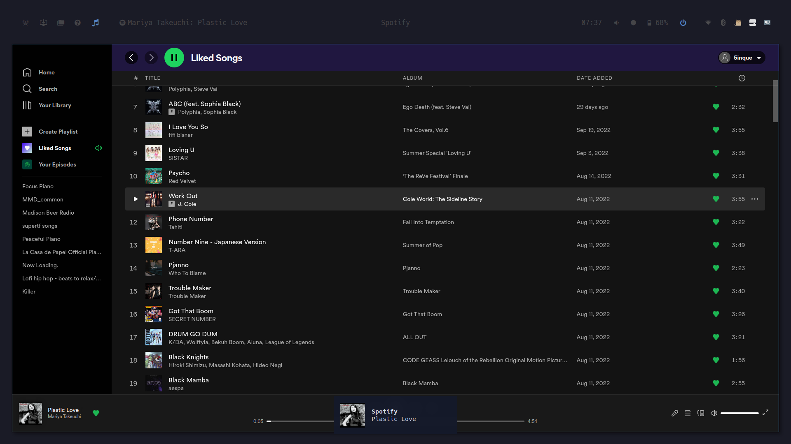
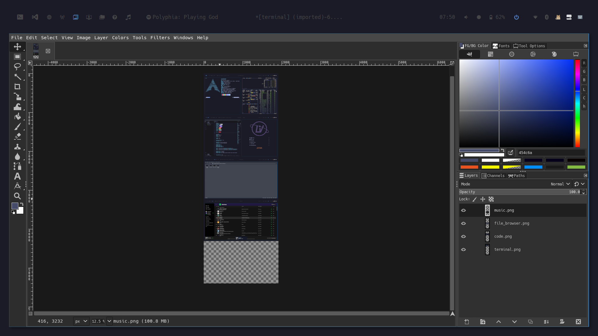
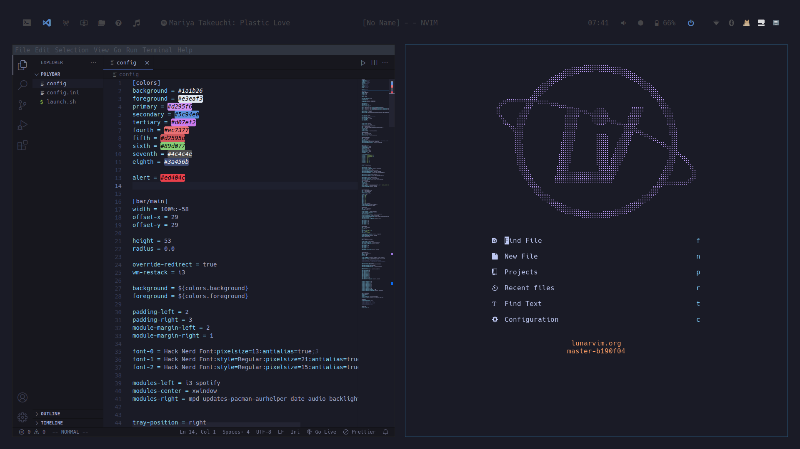

# arch-i3

Dotfiles for my i3wm config.
These can be annoyingly long and dull, because it's also a reminder of how I
set them up to myself.
Hope you find theme useful in some way.

## Programs that I use

- OS: Arch Linux
- Machine: 2020 13.3" Razer Blade Stealth
- Terminal: Kitty/Urxvt
- Terminal Prompt: Powerlevel10k
- WM: i3
- Status bar: polybar
- fetch: neofetch/macchina
- launcher: rofi
- sys monitor: btop
- notification: dunst
- text editor: vim / lunarvim
- code editor: vs code/vscodium
- image viewer: feh
- music player: spotify
- video player: haruna
- browser: google-chrome-stable
- file manager: pcmanfm/nautilus
- colorscheme: tokyo-night

I like simple and clean setup, so I got rid of fancy wallpaper transparency
and blur all together so I can focus more on what I'm currently working or
enjoying.

(I've tried awesome and hyprland, but i3 is just too comfortable to tweak
around, I might eventually switch to hyprland, the animations are just too good)

## screenshots


**Autotilling**
> There should be a gif

**Sys info**


**Web Browser**


**Music**


**Photo processing**


**Coding**


## Installation/setup

I would advise against copy and paste all my config blindly. It's better to
just pick and choose what you might find to your liking, that's how I built
mine.

But if you like to try them out and willing to take the time to fix whatever might
be broken in my config, here's what I do.

1. clone this repo
```bash
cd
git clone https://github.com/mino29/arch-i3.git
```

2. install all the packages (some maybe unnecessary)
```bash
cd ~/arh-i3/programs
paru -S -< packages.list --noconfirm --needed
```

3. fix whatever might be broken yourself
Good Luck!

## clash-for-windows setup

- [zhihu reference](https://zhuanlan.zhihu.com/p/396272999)
- [Arch Linux Clash](https://blog.linioi.com/posts/clash-on-arch/)

## mouse and touchpad config

- [synaptics](https://wiki.archlinux.org/title/Touchpad_Synaptics)

I prefer:
- reverse/natural scrolling
- single click to left click
- double finger click to right click
- no tapping

## default programs

- vim -> .md, .txt
- zathura -> .pdf
- foliate -> .epub
- ebook viewer -> .mobi
- haruna -> .mp4, .ts, .mov

## some processes

**countdown-cli**
a neat little count down tool

```bash
export RELEASE="1.0.0"
wget https://github.com/antonmedv/countdown/releases/download/v$RELEASE/countdown_linux_amd64 -O countdown
chmod +x countdown
sudo mv countdown /usr/local/bin
```

```
usage:
    countdown 5s
    countdown 10m
```

## fonts

places where you have to set font

terminal:
    *kitty (`~/.config/kitty/kitty.conf)\
    *urxvt (`~/.Xresources)\
gui widgets: lxappearance
status bar: polybar
code editor: vscode/ vscodium
browser: google-chrome humble-new-tab-page

## colorscheme

Primary: TokyoNight
Secondary: Dracula
Tertiary: Gruvbox

Use to love Nord, then realise the low contrast is hurting, switch to
TokyoNight. Wherever TokyoNight is unavailable I use Dracula. If neither are
available I use Gruvbox.

Making a colorscheme takes too much work and I'm too lazy for that.

## text editor

**vim**

I forked a "minimal_vim", which is a cross platform, (neo)vim compatible,
dependency free config that you can bascially use anywhere.

It's simple, speedy and pretty good-looking. (uses gruvbox colorscheme)

**lunarvim**

It's the most beautiful and functional neovim distribution that I ever used.
The maintainer Chris streams sometimes, I learned a lot from his neovim from
scratch youtube series.

**vscodium**

The only gui text editor that I use, has similar keybinds to my minimal vim config.
Nothing special.

## Todos

[ ] reduce or eliminate transparency in custom rofi theme
[ ] setup functional rofi powermenu
[ ] setup rofi/buku_run with a proper theme
[ ] modify zsh prompt theme to be more git friendly
[ ] telegram doesn't work
[ ] signal doesn't work
[ ] rofi menu to show current opened webtabs/bookmarks/search/url field (bind
to super+b)

## credit
[r/unixporn]()
[Lunarvim]()
[minimal vim]()
